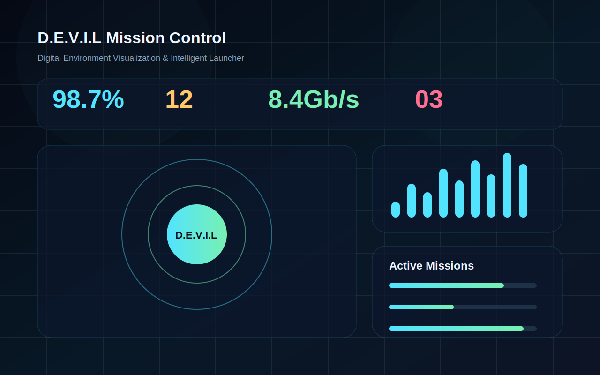

# D.E.V.I.L Mission Control

[](https://github.com/dinmani25-cmd/tablet-dashbord/actions/workflows/pages.yml)

D.E.V.I.L Mission Control is a production-ready React, TypeScript, and Vite progressive web app for a futuristic tablet dashboard. D.E.V.I.L stands for **Digital Environment Visualization & Intelligent Launcher**.



## Highlights

- Futuristic glassmorphism interface with a dark command-center visual system.
- Tablet-first layout that also adapts cleanly to mobile and desktop screens.
- Animated mission topology, live telemetry bars, status cards, and mission progress widgets.
- Progressive Web App setup with manifest metadata, installable icon assets, and a cache-first service worker.
- GitHub Pages deployment workflow configured for the repository path `/tablet-dashbord/`.
- Strict TypeScript, ESLint, and Vite production build scripts.

## Tech Stack

- React 19
- TypeScript 5
- Vite 7
- CSS modules-style component organization with plain CSS
- GitHub Actions and GitHub Pages

## Getting Started

```bash
npm install
npm run dev
```

Open the local URL printed by Vite. For a production build:

```bash
npm run build
npm run preview
```

## Project Structure

```text
.
├── .github/workflows/pages.yml
├── docs/screenshot-dashboard.svg
├── public/
│   ├── icons/
│   ├── manifest.webmanifest
│   └── sw.js
├── src/
│   ├── App.css
│   ├── App.tsx
│   ├── main.tsx
│   └── styles.css
├── index.html
├── package.json
└── vite.config.ts
```

## Deployment

The app is configured for GitHub Pages with Vite's `base` set to `/tablet-dashbord/`. Pushes to `main` trigger `.github/workflows/pages.yml`, which builds the app and deploys the `dist` artifact using GitHub's official Pages action.

After the first workflow run, the live app should be available at:

```text
https://dinmani25-cmd.github.io/tablet-dashbord/
```

If Pages has not been enabled for the repository yet, open the repository settings, choose **Pages**, and set the source to **GitHub Actions**.

## Branding

All user-facing branding uses D.E.V.I.L. No legacy J.A.R.V.I.S labels are present in the application shell, metadata, manifest, documentation, or generated assets.

## License

MIT
